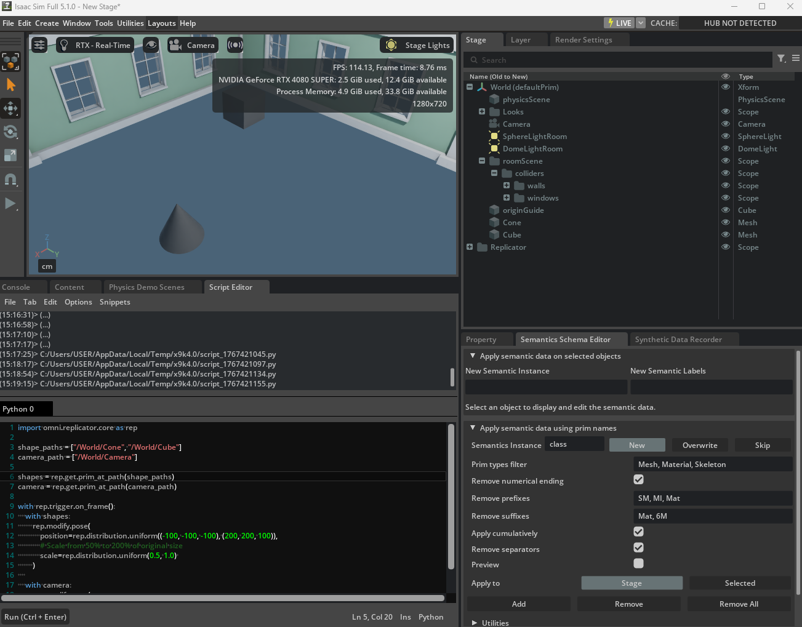
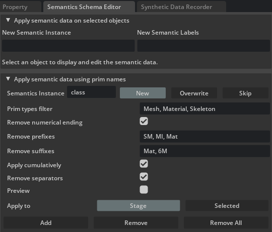
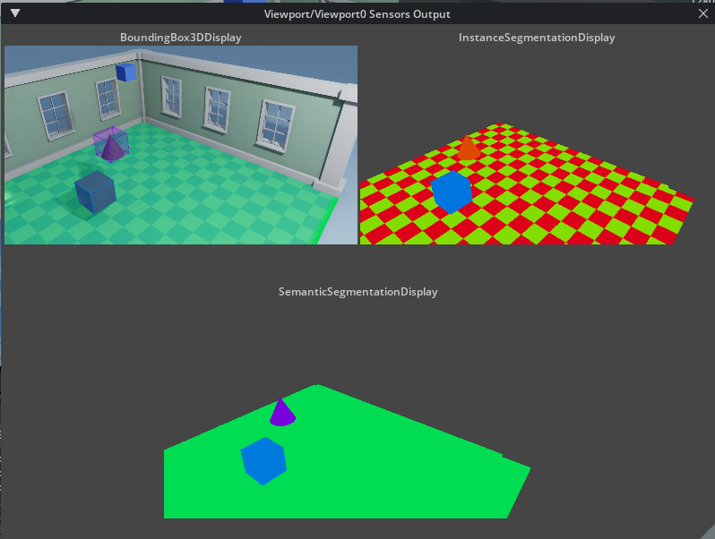
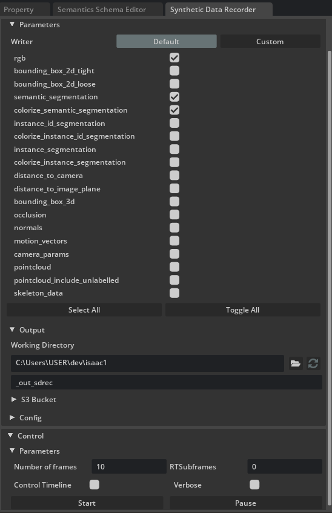

# GUI

---

## Basic script for randomizing
```python
import omni.replicator.core as rep

# Separate camera node to maintain a distant perspective.
shape_paths = ["/World/Cone", "/World/Cube"]
camera_path = ["/World/Camera"]

shapes = rep.get.prim_at_path(shape_paths)
camera = rep.get.prim_at_path(camera_path)

with rep.trigger.on_frame():
    with shapes:
        rep.modify.pose(
            position=rep.distribution.uniform((-100, -100, -100), (200, 200, 100)),
            # Scale from 50% to 100% of original size
            scale=rep.distribution.uniform(0.5, 1.0) 
        )
    
    with camera:
        rep.modify.pose(
            position=rep.distribution.uniform((350, 350, 350), (400, 400, 400))
        )
```
## Semantics schema Editor


Click Add to define the semantic labeling for your objects. This allows you to control the segmentation data captured in your renders.

After that, Now I can see the segmentation from the viewport of sensor output.


---
## Synthetic data recorder


### Key Settings:
* **Writer Selection:** Check the specific data types needed (e.g., `rgb`, `semantic_segmentation`, `colorize_semantic_segmentation`).
* **Output Path:** Set the **Working Directory** to define where the generated files will be saved.
* **Capture Control:** Set the **Number of frames** to determine how many data samples to generate, then click **Start**.
